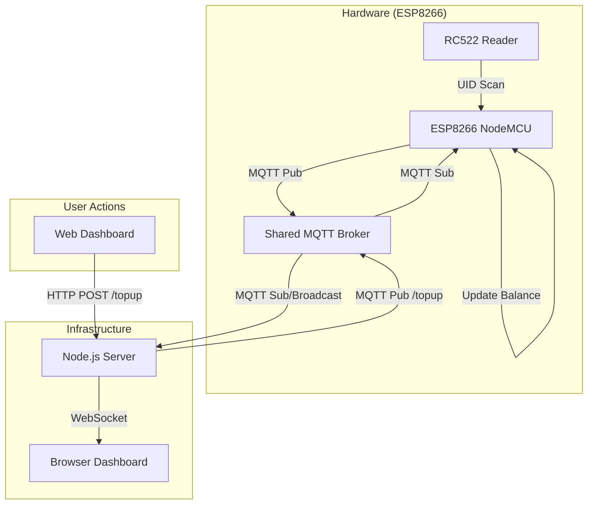

# 💳 RFID Integrated MQTT Payment System (Term 1)

> A state-of-the-art, real-time IoT payment solution featuring a premium dashboard, persistent per-UID balance tracking, and multi-protocol communication.

---

## 🏗 System Architecture

The following diagram illustrates the data flow: **Hardware** ↔ **MQTT Broker** ↔ **Node.js Backend** ↔ **WebSocket** ↔ **Web Dashboard**.



---

## 🛠 Hardware Specifications

### Wiring Diagram (NodeMCU to RC522)

| RC522 Pin    | ESP8266 Pin | Description             |
| :----------- | :---------- | :---------------------- |
| **SDA (SS)** | **D8**      | SPI Slave Select        |
| **SCK**      | **D5**      | SPI Clock               |
| **MOSI**     | **D7**      | SPI Master Out Slave In |
| **MISO**     | **D6**      | SPI Master In Slave Out |
| **GND**      | **GND**     | Common Ground           |
| **RST**      | **D3**      | Reset Pin               |
| **3.3V**     | **3.3V**    | Power Supply            |

### Firmware Logic

The firmware uses a `std::map<String, int>` to maintain independent balances for every card scanned. This ensures that memory is used efficiently and card balances are isolated.

---

## 📡 Communication Protocol (MQTT)

**Team ID:** `1nt3rn4l_53rv3r_3rr0r` | **Host:** `157.173.101.159:1883`

| Action             | Topic                                     | Payload                              | Description                         |
| :----------------- | :---------------------------------------- | :----------------------------------- | :---------------------------------- |
| **Status Event**   | `rfid/1nt3rn4l_53rv3r_3rr0r/card/status`  | `{"uid": "...", "balance": 0}`       | Published when a card is scanned.   |
| **Top-up Command** | `rfid/1nt3rn4l_53rv3r_3rr0r/card/topup`   | `{"uid": "...", "amount": 100}`      | Sent by backend to trigger top-up.  |
| **Balance Sync**   | `rfid/1nt3rn4l_53rv3r_3rr0r/card/balance` | `{"uid": "...", "new_balance": 100}` | Published by hardware after update. |

---

## 💻 Software Components

### 1. Web Dashboard (Frontend)

A high-fidelity **Tailwind CSS** dashboard with:

- **Glassmorphism Design:** Dark theme with transparent backdrop blurs.
- **Dynamic Connection:** Automatically detects hosting environment (Local vs VPS).
- **Log Terminal:** Real-time stream of all system events.

### 2. Node.js Backend

- **Express Server:** Handles manual top-up requests via REST API.
- **MQTT Translator:** Bridges hardware events to the web.
- **WebSocket Server:** Pushes live events to all connected clients instantly.

---

## 🔌 API Documentation

### **POST** `/topup`

Used by the dashboard or external tools to add funds to a card.

**Request Body:**

```json
{
  "uid": "1a2b3c4d",
  "amount": 1000
}
```

**Validation Rules:**

- `amount` must be between `1` and `1,000,000`.
- `uid` must be a valid string.

---

## 🚀 Deployment Guide

### **Local Setup**

1.  **Clone:** `git clone <repo-url>`
2.  **Install:** `npm install`
3.  **Start:** `node server.js`
4.  **Access:** `http://localhost:5000`

### **VPS Deployment**

1.  **Connect:** `ssh user271@157.173.101.159`
2.  **Transfer:** Use `scp` to move `server.js`, `package.json`, and `public/`.
3.  **Execute:**
    ```bash
    npm install
    sudo npm install -g pm2
    pm2 start server.js --name "rfid-system"
    ```
4.  **Access:** `http://157.173.101.159:5000`

---

## ❓ Troubleshooting

- **Connection Lost?** Check the VPS firewall: `sudo ufw allow 5000`.
- **Card not reading?** Verify SPI wiring (specifically SDA on D8 and RST on D3).
- **Balance incorrect?** Ensure `RFID_MQTT.ino` was flashed with the latest version using `std::map`.

---
