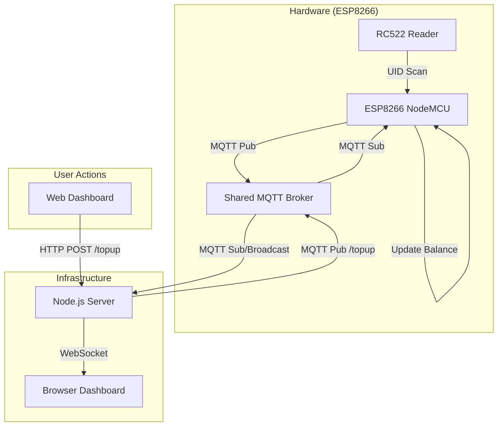

# 💳 RFID Integrated MQTT Payment System (Term 1)

> A state-of-the-art, real-time IoT payment solution featuring a premium dashboard, persistent per-UID balance tracking, and multi-protocol communication.

---

## 🏗 System Architecture

The following diagram illustrates the data flow: **Hardware** ↔ **MQTT Broker** ↔ **Node.js Backend** ↔ **WebSocket** ↔ **Web Dashboard**.



---

## 🛠 Hardware Specifications

### Wiring Diagram (NodeMCU to RC522)

| RC522 Pin    | ESP8266 Pin | Description             |
| :----------- | :---------- | :---------------------- |
| **SDA (SS)** | **D8**      | SPI Slave Select        |
| **SCK**      | **D5**      | SPI Clock               |
| **MOSI**     | **D7**      | SPI Master Out Slave In |
| **MISO**     | **D6**      | SPI Master In Slave Out |
| **GND**      | **GND**     | Common Ground           |
| **RST**      | **D3**      | Reset Pin               |
| **3.3V**     | **3.3V**    | Power Supply            |

### Firmware Logic

The firmware uses a `std::map<String, int>` to maintain independent balances for every card scanned. This ensures that memory is used efficiently and card balances are isolated.

---

## 📡 Communication Protocol (MQTT)

**Team ID:** `1nt3rn4l_53rv3r_3rr0r` | **Host:** `157.173.101.159:1883`

| Action             | Topic                                     | Payload                              | Description                         |
| :----------------- | :---------------------------------------- | :----------------------------------- | :---------------------------------- |
| **Status Event**   | `rfid/1nt3rn4l_53rv3r_3rr0r/card/status`  | `{"uid": "...", "balance": 0}`       | Published when a card is scanned.   |
| **Top-up Command** | `rfid/1nt3rn4l_53rv3r_3rr0r/card/topup`   | `{"uid": "...", "amount": 100}`      | Sent by backend to trigger top-up.  |
| **Balance Sync**   | `rfid/1nt3rn4l_53rv3r_3rr0r/card/balance` | `{"uid": "...", "new_balance": 100}` | Published by hardware after update. |

---

## 💻 Software Components

### 1. Web Dashboard (Frontend)

A high-fidelity **Tailwind CSS** dashboard with:

- **Glassmorphism Design:** Dark theme with transparent backdrop blurs.
- **Dynamic Connection:** Automatically detects hosting environment (Local vs VPS).
- **Log Terminal:** Real-time stream of all system events.

### 2. Node.js Backend

- **Express Server:** Handles manual top-up requests via REST API.
- **MQTT Translator:** Bridges hardware events to the web.
- **WebSocket Server:** Pushes live events to all connected clients instantly.

---

## 🔌 API Documentation

### **POST** `/topup`

Used by the dashboard or external tools to add funds to a card.

**Request Body:**

```json
{
  "uid": "1a2b3c4d",
  "amount": 1000
}
```

**Validation Rules:**

- `amount` must be between `1` and `1,000,000`.
- `uid` must be a valid string.

---

## 🚀 Deployment Guide

### 💻 Local Environment Setup

Follow these steps to get the entire system running on your local machine and hardware.

#### 1. Software Prerequisites

- **Node.js**: [Download & Install](https://nodejs.org/) (v16+ recommended).
- **Arduino IDE**: [Download & Install](https://www.arduino.cc/en/software).
- **MQTT Explorer (Optional)**: Great for debugging. [Download here](http://mqtt-explorer.com/).

#### 2. ESP8266 Firmware Setup

1.  **Open Project**: Open `RFID_MQTT/RFID_MQTT.ino` in Arduino IDE.
2.  **Board Manager**:
    - Go to `File > Preferences`.
    - Add to "Additional Boards Manager URLs": `http://arduino.esp8266.com/stable/package_esp8266com_index.json`
    - Go to `Tools > Board > Boards Manager`, search for **esp8266**, and install.
3.  **Install Libraries**: Go to `Sketch > Include Library > Manage Libraries` and install:
    - **MFRC522** (by GithubCommunity)
    - **PubSubClient** (by Nick O'Leary)
    - **ArduinoJson** (by Benoit Blanchon)
4.  **Configure Code**:
    - Update `WIFI_SSID` and `WIFI_PASS` in `RFID_MQTT.ino` (Lines 11-12).
    - Ensure `MQTT_HOST` is set correctly (Line 13).
5.  **Flash**: Select your board (e.g., NodeMCU 1.0) and Port, then click **Upload**.

#### 3. Node.js Backend Setup

1.  **Open Terminal**: Navigate to the project root directory.
2.  **Install Dependencies**:
    ```bash
    npm install
    ```
3.  **Start Server**:
    ```bash
    node server.js
    ```
    _Note: The backend acts as a translator, bridging MQTT events to the web dashboard via WebSockets._

#### 4. Access the Dashboard

- Open your browser and go to: `http://localhost:5000`
- Scan an RFID card; you should see the UID and balance appear in the log terminal instantly.

---

## 🌐 Live Dashboard

Access the deployed system dashboard here:
👉 **[RFID System Live Dashboard](http://157.173.101.159:9271/rfid-dashboard.html)**

---

- **"Serial Port not found"**: Ensure you have the [CH340 drivers](https://sparks.gogo.co.nz/ch340.html) installed for your NodeMCU.
- **WebSocket Connection Failed**: Ensure `server.js` is running and `PORT 5000` is not blocked by your local firewall.
- **MQTT Connection Failed**: Check your internet connection and ensure the host `157.173.101.159` is reachable.
- **Card not reading?** Double-check the SPI wiring. The most common error is swapping SDA (D8) or RST (D3).
- **Balance remains 0?** The system uses `std::map` in RAM; if the ESP8266 restarts, balances will reset unless top-ups are re-issued.

---
